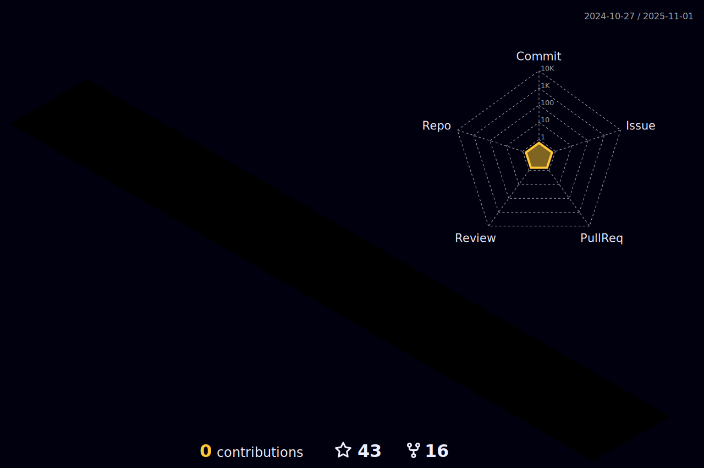

###  💫 About Me:
##  Hey , I'm Prayag    I am from Bandhavgarh, India .   

### About:

 -  ✔️Being a non-techie, when I am starting my steps toward learning web development, I feel afraid because it is entirely new for me as I am a tourism graduate shifting my career entirely in a different direction.Still, at the same time, I am also interested to learn about how technology works and had always been fascinated with how using coding, you can create great products and solve various problems. So I decided it's never too late to start something you like. For this reason, I started my journey toward learning computer languages, and I am working on it. 

- 🔭 I’m currently working on **Java and Spring boot**

- 🌱 I’m currently learning **Full Stack web development in Masai school, Banglore**

- 👯 I’m looking to collaborate on **developing full stack web development applications**

- 🤝Seeking to leverage my skills in a challenging work environment.

- 👨‍💻 Find my portfolio at <a href="https://prayagp8.github.io" target="blank">My Portfolio</a>

- 💬 Ask me about **Java, Spring boot, Java Script and Data structures and Algorithms.**

- 📫 Reach me at **prayagp8@gmail.com**

- 📄 Know about my experiences from <a href="https://drive.google.com/file/d/10qJBjQqiEWfQo5XoC7RfgjcwoYVH_JyR/view?usp=sharing" target="blank">My Resume</a>

#### ⚡ One line that describes me best?  

A hard working boy who enjoys good humour & coding..😉😉

## 🌐 Socials:
 
## ⚙  Languages and Tools:
<h3 align="left">Languages and Tools:</h3>

          

# 📊 GitHub Stats:
 
 

## ✍️ Random Dev Quote

---

 

  

